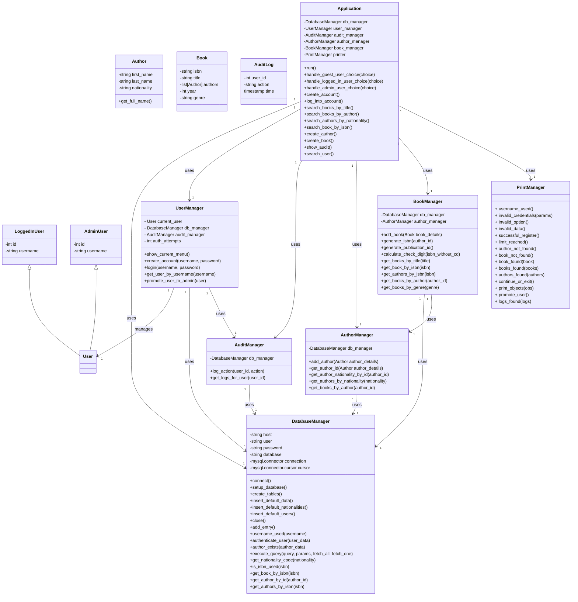

# Book Management System

## Descriere

**Book Management System** este o aplicație simplă pentru gestionarea cărților, autorilor și utilizatorilor într-o bază 
de date. Aplicația permite utilizatorilor să caute cărți, autori și să gestioneze aceste date. Administratorii au 
privilegii suplimentare, cum ar fi adăugarea de noi autori și cărți în baza de date. Proiectul include un sistem de 
audit pentru a urmări acțiunile utilizatorilor.

## Caracteristici Cheie

- ### Gestionarea utilizatorilor
  - Crearea unui cont de utilizator
  
    
  
  - Autentificare
  
    
  
- ### Gestionarea cărților și autorilor
  - Căutare după titlul cărții 
  
    
  
  - Căutare după numele autorului (afișarea tuturor cărților aparținând unui autor)
  
    
  
  - Căutare după naționalitatea autorului (afișarea tuturor autorilor dintr-o anumită țară)
        
    

  - Căutare după ISBN

    

  - Adăugarea informațiilor despre un autor nou
    - Nume
    - Prenume
    - Naționalitate
    
    

  - #### Adăugarea informațiilor unei noi cărți
    - Generarea unui ISBN unic pentru fiecare carte, având prefixul și identificatorul țării din care provine autorul, 
    urmat de identificatorul publicației (generat aleator) și cifra de control (suma primelor 12 cifre modulo 13)
    - Titlul cărții
    - Autorii cărții (trebuie sa fie deja introduși în baza de date)
    - Anul publicării
    - Genul cărții
    
      
    
- ### Sistem de audit pentru urmărirea acțiunilor utilizatorilor
  - Afișarea tuturor acțiunilor efectuate de un anumit utilizator
      
     
  
- ### Roluri diferite pentru utilizatori
  - Guest: are doar opținea de a-și crea un cont nou sau de a se conecta la un cont existent
  - Logged-in User: are acces doar la căutarea de cărți și autori
  - Admin: are acces la toate funcționalitățile aplicației (inclusiv promovarea unui utilizator obișnuit la rolul de Admin)

    

## Diagrama Entitate-Relație

## Diagrama claselor
    

## Dependente
- Python - 3.x
- MySQL Server
- MySQL Connector for Python - 9.0
- pwinput - 1.0.3